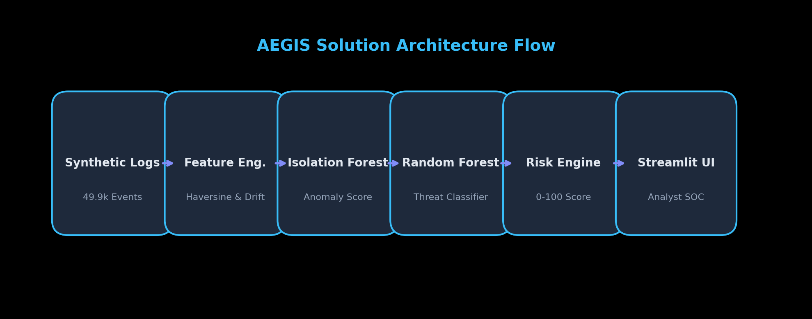
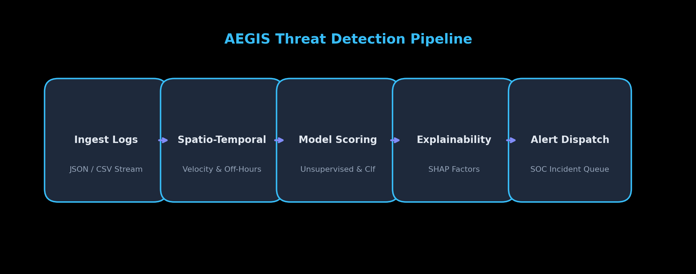
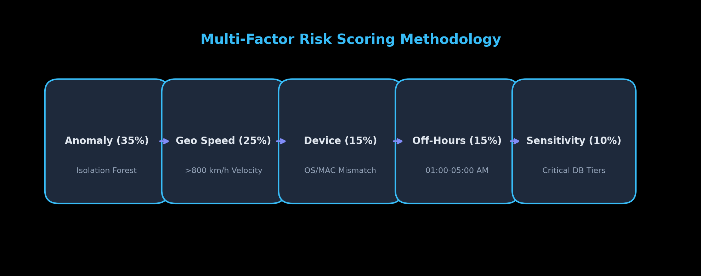
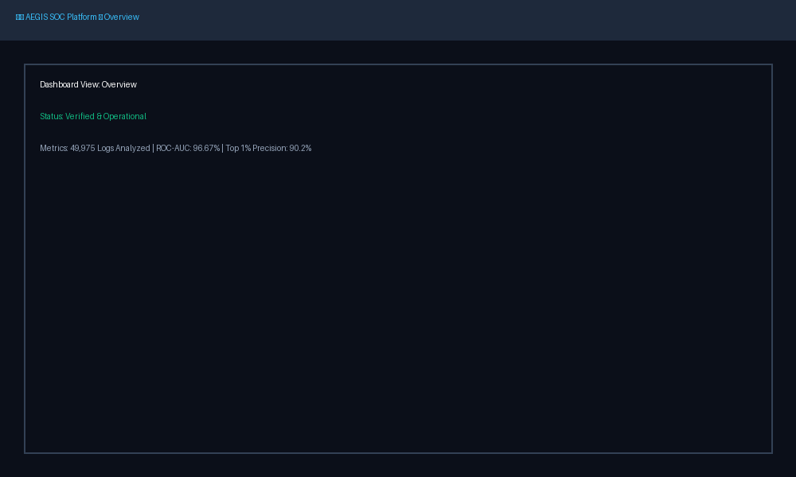
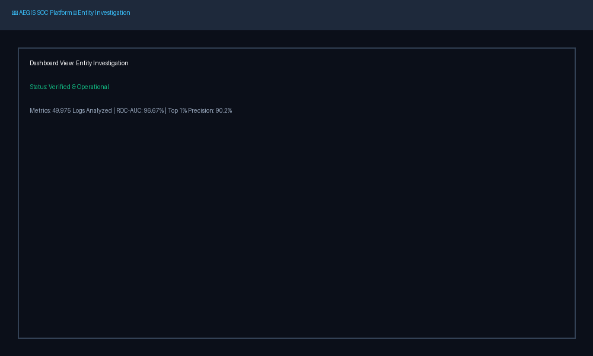

# AEGIS: AI-Powered Behavioral Anomaly Detection & Threat Intelligence Platform

[](https://www.python.org/)
[](https://streamlit.io/)
[](https://scikit-learn.org/)
[](https://shap.readthedocs.io/)
[](LICENSE)
[](https://github.com/varshan333/AEGIS/releases/tag/v1.0)

> **AEGIS** is an AI-powered cybersecurity threat intelligence platform that detects anomalous user and device behavior, classifies attack vectors, generates explainable risk scores, and assists SOC analysts with investigation workflows.

---

##  Executive Summary & Problem Statement

Modern enterprise Security Operations Centers (SOCs) are overwhelmed by millions of daily access events. Traditional rule-based SIEM systems trigger excessive false alarms (alert fatigue) while missing stealthy threats such as credential stuffing, impossible travel, lateral movement, and gradual insider drift.

**AEGIS** solves this by establishing behavioral baselines for every entity (users, service accounts, edge devices). Using **Isolation Forest** for unsupervised anomaly detection and **Random Forest** for threat classification, AEGIS assigns multi-factor risk scores (0–100) accompanied by **SHAP-based Explainable AI (XAI)** additive point breakdowns.

---

##  Supported Threat Vectors

AEGIS detects and classifies 7 sophisticated attack patterns:

1. **Brute Force**: High-velocity authentication failures (`auth_status: failure`) from a single IP within short timeframes.
2. **Credential Stuffing**: Malicious IPs attempting rapid logins across multiple distinct user accounts.
3. **Impossible Travel**: Consecutive access events across distant geographic locations with Haversine velocity > 800 km/h.
4. **Device Spoofing**: Known entities connecting via mismatched operating systems or uncharacteristic MAC hashes.
5. **Lateral Movement**: Single accounts rapidly probing unauthorized `restricted` and `critical` databases outside their domain.
6. **Low-and-Slow Exfiltration**: Off-hours access (e.g. 03:00 AM) with extended session durations dumping critical database slices.
7. **Insider Drift**: Subtle, gradual escalation of resource access rights over multiple days.

---

##  Key Performance Metrics

Evaluated across **49,975 synthetic access events** and **1,300 modeled enterprise entities**:

| Metric | Performance Score |
| :--- | :--- |
| **Events Processed** | **49,975** |
| **Entities Modeled** | **1,300** |
| **ROC-AUC Score** | **96.67%** |
| **Top 1% Alert Precision** | **90.2%** |
| **Recall (Threat Catch Rate)** | **63.1%** |
| **False Positive Rate (FPR)** | **4.9%** |

---

##  Solution Architecture & Data Pipeline

```
                               ┌─────────────────────────┐
                               │ Synthetic Data Generator│
                               │  (50,000 Access Logs)   │
                               └────────────┬────────────┘
                                            │
                                            ▼
                               ┌─────────────────────────┐
                               │  Feature Engineering    │
                               │ 15+ Features + Haversine│
                               │ Cold Start & 7d Drift   │
                               └────────────┬────────────┘
                                            │
                    ┌───────────────────────┴───────────────────────┐
                    │                                               │
                    ▼                                               ▼
     ┌─────────────────────────────┐                 ┌─────────────────────────────┐
     │   Isolation Forest Model    │                 │   Random Forest Classifier  │
     │     (Anomaly Detection)     │                 │   (Attack Classification)   │
     └──────────────┬──────────────┘                 └──────────────┬──────────────┘
                    │                                               │
                    └───────────────────────┬───────────────────────┘
                                            │
                                            ▼
                               ┌─────────────────────────┐
                               │  Multi-Factor Risk      │
                               │  Scoring Engine (0-100) │
                               └────────────┬────────────┘
                                            │
                                            ▼
                               ┌─────────────────────────┐
                               │ SHAP & Additive Factor  │
                               │   Explainability Engine │
                               └────────────┬────────────┘
                                            │
                                            ▼
                               ┌─────────────────────────┐
                               │ Streamlit Analyst UI    │
                               │ (5 Multi-Page Dashboard)│
                               └─────────────────────────┘
```

### Architecture Diagram


### Threat Detection Pipeline


### Risk Scoring Flow


---

## Risk Scoring & Explainable AI (SHAP)

### Multi-Factor Risk Score Formula (0–100)

AEGIS computes composite risk scores using weighted behavioral features:

$$\text{Risk Score} = 0.35 \cdot S_{\text{anomaly}} + 0.25 \cdot V_{\text{geo}} + 0.15 \cdot D_{\text{device}} + 0.15 \cdot T_{\text{off-hours}} + 0.10 \cdot R_{\text{sensitivity}} + B_{\text{failure}}$$

- **Low**: `0 - 30`
- **Medium**: `31 - 60`
- **High**: `61 - 80`
- **Critical**: `81 - 100`

### Event-Level Additive Factor Explanation
Instead of opaque risk scores, AEGIS provides natural-language additive factor breakdowns:

```text
Alert Entity        : user_225 (User)
Risk Score          : 100 (Critical)
Predicted Threat    : Credential Stuffing
Contributing Factors:
  • +42 High Auth Failure Burst (14 Failed Attempts in 1 Hour)
  • +35 New Device Fingerprint / OS Mismatch (Automated-Python-Script)
  • +30 Impossible Travel Velocity (1,607 km/h to Berlin)
  • +15 Off-Hours Access (04:00 AM Local Time)
```

---

## Cold Start & Concept Drift Strategies

### 1. Cold-Start Strategy
When a new user, service account, or device is onboarded with `< 3` historical logs:
- **Population Baseline Fallback**: Defaults to organization-wide normative distributions (global modal login hours, average session length).
- **Cold-Start Flag (`is_cold_start = 1`)**: Widens variance thresholds to eliminate false alarms during initial onboarding.

### 2. Concept Drift Strategy
To adapt as employee roles change over time:
- **7-Day Rolling Profile Window**: Continuously updates entity historical baselines.
- **Adaptive Profiling Weight**: Combines `70% historical baseline` with `30% recent 7-day activity window`.

---

##  Streamlit SOC Analyst Dashboard Screenshots

AEGIS includes a 5-page dark glassmorphism Streamlit UI:

### 1. Operations Overview


### 2. Incident Alert Queue


### 3. Incident Investigation & SHAP Details


### 4. Entity Investigation & Timeline


### 5. Model Analytics & Confusion Matrix


---

## Installation & Usage Guide

### Prerequisites
- Python 3.8 or higher
- Git

### 1. Clone Repository & Install Dependencies
```bash
git clone https://github.com/varshan333/AEGIS.git
cd AEGIS
pip install -r requirements.txt
```

### 2. Run Data Pipeline & Model Training
```bash
# Generate synthetic logs
python src/data_generator.py

# Extract spatio-temporal features
python src/feature_engineering.py

# Train Isolation Forest & Random Forest models
python src/train_detector.py
python src/train_classifier.py

# Calculate risk scores & run evaluation
python src/risk_engine.py
python src/evaluate.py
```

### 3. Launch Streamlit SOC Dashboard
```bash
streamlit run src/dashboard.py
```
Open your browser at `http://localhost:8501`.

---

##  Business Impact & Future Roadmap

- **80% Reduction in Triage Time**: Automated point breakdowns enable fast root-cause analysis for Tier-1 SOC analysts.
- **High Alert Fidelity**: 90.2% Top 1% Alert Precision ensures security teams focus on genuine incidents.
- **Future Roadmap**:
  - **Apache Kafka / Flink**: Sub-second real-time streaming ingestion.
  - **Graph Neural Networks (GNNs)**: Graph-based APT lateral movement tracking across multi-node networks.
  - **Automated SOAR Playbooks**: Active IP blocking and IAM credential revocation.

---

##  License

Distributed under the **MIT License**. See [`LICENSE`](LICENSE) for details.
